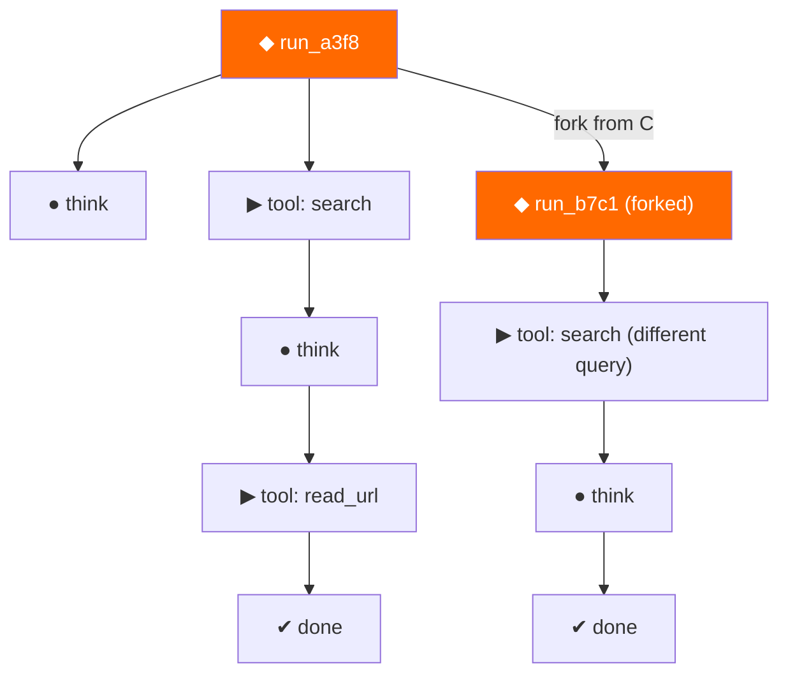

<p align="center">
  
</p>

<h1 align="center">opentine</h1>

<p align="center">
  <strong>Git for agent runs. Fork, replay, resume any execution.</strong><br>
  ~250 lines of core. Any model. Zero lock-in.
</p>

<p align="center">
  <a href="https://pypi.org/project/opentine/"></a>
  <a href="https://github.com/0xcircuitbreaker/opentine/blob/main/LICENSE"></a>
  <a href="https://pypi.org/project/opentine/"></a>
  <a href="https://github.com/0xcircuitbreaker/opentine/actions"></a>
</p>

---

A **tine** is the prong of a fork. opentine literally forks your agent runs.

Every agent execution becomes a **run tree** — content-addressed, serializable, forkable. Pause on your laptop, resume on a server. Branch from step 7 with a different prompt. Diff two runs side by side. All in ~250 lines of core.

<!-- Hero GIF: tine show rendering a tree, then tine fork creating a branch -->

## Quickstart

```bash
pip install opentine
```

Write a 5-line agent:

```python
from opentine import Agent
from opentine.models.anthropic import Anthropic

agent = Agent(model=Anthropic("claude-sonnet-4-20250514"))
run = agent.run_sync("Find the mass of the sun in kilograms")
run.save("solar.tine")
```

See what happened:

```bash
tine show solar.tine
```

```
◆ run_a3f8c2  model=claude-sonnet-4-20250514  steps=4  cost=$0.003  12s
├── ● think  "I'll search for the sun's mass..."
├── ▶ tool   search("mass of the sun in kg")
├── ● think  "The mass is approximately 1.989 × 10³⁰ kg..."
└── ✔ done   "The mass of the Sun is approximately 1.989 × 10³⁰ kg."
```

## The Killer Demo

Your agent fails after 10 steps. Instead of re-running everything:

```bash
# See where it went wrong
tine show failed_run.tine

# Fork from step 7, before the bad tool call
tine fork failed_run.tine --from-step 7 --save fixed_run.tine

# Resume with a patched prompt
tine resume fixed_run.tine
```

Three commands. No re-running the first 7 steps. No lost context. No wasted API calls.

```bash
# Compare the runs
tine diff failed_run.tine fixed_run.tine
```

## Why opentine?

| | Install size | Forkable runs | Any model | Core LOC |
|---|---|---|---|---|
| LangChain | 166 MB | No | Partial | ~200k |
| LangGraph | 51 MB | Checkpoints only | Partial | ~50k |
| CrewAI | 173 MB | No | Partial | ~30k |
| smolagents | 198 MB | No | Partial | ~15k |
| **opentine** | **<5 MB** | **Yes** | **Yes** | **~250** |

## How It Works

Every agent execution produces a **run tree**: a content-addressed DAG of steps.



Each step is hashed from its inputs — identical inputs always produce the same step ID. This means:
- **Fork** = copy the tree up to a point, then diverge
- **Replay** = re-execute from a step, compare outputs
- **Diff** = walk two trees, highlight where they diverge
- **Pause/Resume** = serialize the tree + pending state to a `.tine` file

## Model Support

opentine treats every model equally. No first-class provider. Swap with one line.

```python
from opentine.models.anthropic import Anthropic
from opentine.models.openai import OpenAI
from opentine.models.google import Google
from opentine.models.ollama import Ollama

# Same agent, different brain
agent = Agent(model=Anthropic("claude-sonnet-4-20250514"))
agent = Agent(model=OpenAI("gpt-4o"))
agent = Agent(model=Google("gemini-2.0-flash"))
agent = Agent(model=Ollama("llama3.1"))
```

Any OpenAI-compatible provider works out of the box:

```python
from opentine.models.compat import Kimi, DeepSeek, Qwen, GLM, Groq, Together, Mistral

agent = Agent(model=Kimi("moonshot-v1-8k"))
agent = Agent(model=DeepSeek("deepseek-chat"))
agent = Agent(model=Qwen("qwen-plus"))
agent = Agent(model=GLM("glm-4-flash"))
agent = Agent(model=Groq("llama-3.1-70b-versatile"))
agent = Agent(model=Together("meta-llama/Meta-Llama-3.1-70B-Instruct-Turbo"))
agent = Agent(model=Mistral("mistral-large-latest"))
```

## Built-in Tools

```python
from opentine.tools import web, search, fs, shell, python

agent = Agent(
    model=Anthropic("claude-sonnet-4-20250514"),
    tools=[web.fetch, search.search, fs.read, fs.write, shell.run],
)
```

Tools are plain Python functions with type hints. No decorators, no schemas, no framework. opentine introspects the signature.

## CLI Reference

```
tine run <script.py>          Execute agent, stream steps, save run tree
tine ls                       List recent runs (status, cost, model)
tine show <run_id>            Pretty-print the tree (like git log --graph)
tine replay <id> [--from N]   Replay from a step
tine fork <id> --from-step N  Branch a new run
tine diff <run_a> <run_b>     Side-by-side comparison
tine resume <run_id>          Resume a paused run
```

## The Name

A **tine** is a prong of a fork.

opentine is an open-source tool that forks your agent runs — branching execution trees the way git branches code. The `.tine` file extension stores serialized run trees, and the `tine` CLI is the command you type.

## Contributing

We welcome contributions. Please open an issue or PR.

```bash
git clone https://github.com/0xcircuitbreaker/opentine.git
cd opentine
uv sync --all-extras
uv run pytest
uv run ruff check .
```

## License

Apache 2.0 — see [LICENSE](LICENSE).

Built by the [opentine contributors](https://github.com/0xcircuitbreaker/opentine/graphs/contributors).

[opentine.com](https://opentine.com)
