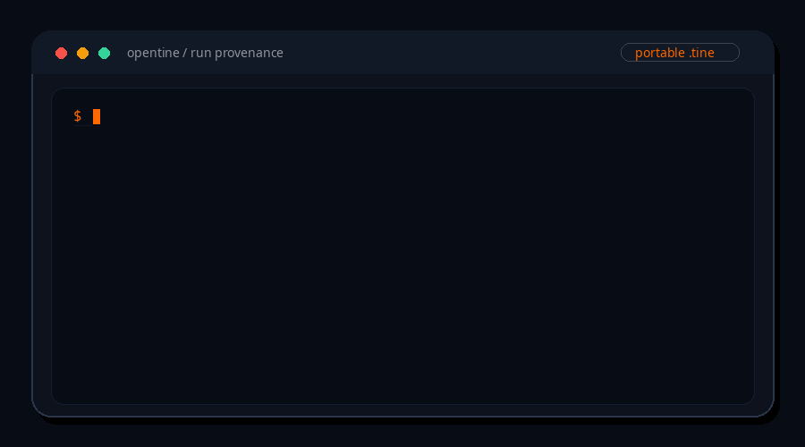
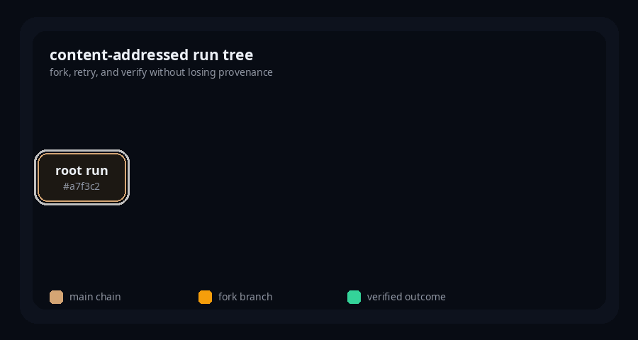
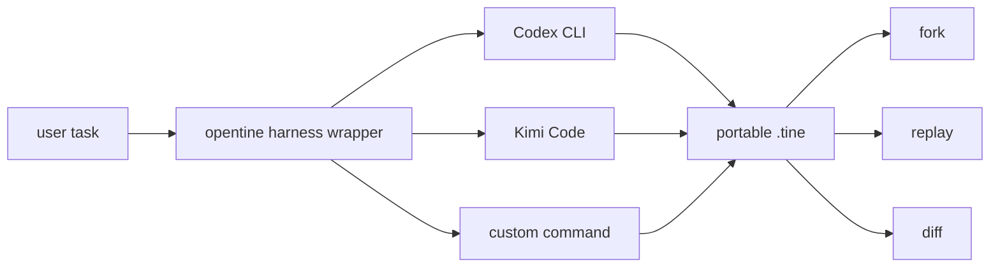

<p align="center">
  
</p>

<h1 align="center">opentine</h1>

<p align="center">
  <strong>Git for agent runs: record, verify, fork, replay, and diff execution history.</strong><br>
  Portable <code>.tine</code> artifacts for native agents and external CLI harnesses.
</p>

<p align="center">
  <a href="https://pypi.org/project/opentine/"></a>
  <a href="https://github.com/0xcircuitbreaker/opentine/blob/main/LICENSE"></a>
  <a href="https://pypi.org/project/opentine/"></a>
  <a href="https://github.com/0xcircuitbreaker/opentine/actions"></a>
  
</p>

<p align="center">
  
</p>

---

A **tine** is the prong of a fork. opentine forks agent runs.

Every run becomes a content-addressed graph of model calls, tool calls, outputs, errors, cache provenance, and transcript state. Save it as a `.tine` file, verify its checksum, fork from a known-good step, replay recorded work, rerun through an explicit harness, and diff the branch that worked against the branch that failed.


## What You Can Do

```bash
# Inspect a saved execution tree.
tine show result.tine

# Check that the artifact body still matches its recorded checksum.
tine verify result.tine

# Branch from a step before a bad tool call.
tine fork failed.tine --from-step 3 --save retry.tine

# Reuse recorded steps without re-spending model/tool work.
tine replay result.tine --mode cache --save replayed.tine

# Compare the graph shape of two runs.
tine diff failed.tine retry.tine
```

The current 0.1.x public beta readiness pass validates the core surface, Ollama, Codex CLI, and Kimi Code CLI in this environment. Other providers and harnesses are compatibility targets until their own live gates pass.

## Install

```bash
pip install opentine
```

Core runtime dependencies install normally. Provider SDKs are optional extras, and OpenAI-compatible providers share the OpenAI SDK path.

```bash
pip install "opentine[anthropic]"
pip install "opentine[openai]"
pip install "opentine[google]"
pip install "opentine[compat]"
```

## Quickstart

Write a native opentine agent:

```python
from opentine import Agent
from opentine.models.anthropic import Anthropic

agent = Agent(model=Anthropic("claude-sonnet-4-20250514"))
run = agent.run_sync("What is opentine?")
run.save("result.tine")
```

Then inspect and branch the run:

```bash
tine show result.tine
tine verify result.tine
tine fork result.tine --from-step 0 --save forked.tine
tine replay result.tine --inspect
tine diff result.tine forked.tine
```

Example tree shape:

```text
# fe3a767307a4  model=claude-sonnet-4-20250514  steps=3  cost=$0.0006  completed
|-- # 9e4b8c2a19dd think  "Planning the answer..."
|-- > 81bf0f67bb12 tool   search(query="opentine")
`-- + 6d4a0b270a5f done   "opentine records agent runs as portable artifacts..."
```

## The Debugging Loop

Your agent fails after ten steps. Instead of rerunning everything:

```bash
tine show failed_run.tine
tine fork failed_run.tine --from-step 3 --save fixed_run.tine
tine diff failed_run.tine fixed_run.tine
```

That gives you the first three steps as known provenance, a new branch for the repair attempt, and a graph diff that shows what changed.

## How It Works

Every `.tine` file stores a content-addressed DAG. Step IDs are full SHA-256 hashes over canonical immutable step payloads: parent links, kind, inputs, outputs, model/tool metadata, and errors.

<p align="center">
  
</p>

Core operations are graph operations:

| Operation | Meaning |
|---|---|
| Save/load | Serialize the run graph, transcript, cache, manifest, policy metadata, and checksum. |
| Verify | Recompute the SHA-256 checksum in `metadata.integrity`. |
| Fork | Copy ancestors up to a chosen step and continue from there. |
| Replay | Reuse recorded steps, or rerun through an explicit native runtime or harness. |
| Diff | Compare two run graphs and show the common ancestor plus divergent steps. |

`Run.steps` remains a stable traversal view, but the artifact stores a graph with `parent_ids`, named refs, and branch metadata.

## Harnesses

opentine can wrap external CLI agents and record observable events as a `.tine` run:

```bash
tine run --harness codex --prompt "Inspect this repo"
tine run --harness kimi-code --prompt "Summarize README.md"
tine run --harness generic --harness-command "your-agent run" --prompt "Fix tests"
```



Python wrapper API:

```python
from opentine.harnesses import CodexCLIHarness, OpentineHarness

harness = CodexCLIHarness()
wrapped = OpentineHarness(harness, autosave_path="latest.tine", autosave_steps=5)

run = wrapped.run_sync("Refactor auth middleware")
run.save("codex_run.tine")

forked = wrapped.fork(from_step=3)
forked.save("retry_from_step_3.tine")
```

Harness subprocesses are isolated by default. For logged-in CLIs, pass `--harness-login-env` to allow only `PATH`, home/config directory variables, and tool-specific config directory variables. opentine does not write pasted secrets to repo files.

## Support Matrix

Status values are intentionally conservative:

| Target | Status | Evidence |
|---|---:|---|
| Native `.tine` v1 load/save/fork/diff/replay | Validated | Fast tests, golden fixture, and CLI smoke. |
| Artifact checksum verification | Validated | `Run.verify_integrity(...)`, `tine verify`, and failure-path tests. |
| Secure tool defaults | Validated | Filesystem, symlink, network, shell, Python, env, redaction, and output-cap tests. |
| Ollama `llama3.1` and `qwen3` | Validated | Live gate passed in this audit environment. |
| Codex CLI | Validated | Live harness gate passed in this audit environment. |
| Kimi Code CLI | Validated | Live harness gate passed in this audit environment. |
| Anthropic, OpenAI, Google | Scoped | Adapter contract tests; cloud live gates require user credentials. |
| Kimi API, DeepSeek, GLM, Groq, Together, Mistral, Qwen API | Scoped | OpenAI-compatible adapter shape; provider-specific live gates required. |
| LM Studio, vLLM, llama.cpp, LocalAI, Jan, Unsloth-compatible endpoints | Scoped | Endpoint-specific local live gates required. |


## Native Models

The native `Agent` API accepts any implementation of the `Model` protocol. Built-in adapters include:

```python
from opentine.models.anthropic import Anthropic
from opentine.models.google import Google
from opentine.models.ollama import Ollama
from opentine.models.openai import OpenAI

agent = Agent(model=Anthropic("claude-sonnet-4-20250514"))
agent = Agent(model=OpenAI("gpt-4o"))
agent = Agent(model=Google("gemini-2.0-flash"))
agent = Agent(model=Ollama("llama3.1"))
```

OpenAI-compatible wrappers:

```python
from opentine.models.compat import DeepSeek, GLM, Groq, Kimi, Mistral, Qwen, Together

agent = Agent(model=Kimi("moonshot-v1-8k"))
agent = Agent(model=DeepSeek("deepseek-chat"))
agent = Agent(model=Qwen("qwen-plus"))
agent = Agent(model=GLM("glm-4-flash"))
agent = Agent(model=Groq("llama-3.1-70b-versatile"))
agent = Agent(model=Together("meta-llama/Meta-Llama-3.1-70B-Instruct-Turbo"))
agent = Agent(model=Mistral("mistral-large-latest"))
```

These wrappers make integration easy, but a provider is only counted as live-validated after its gate passes in the release environment.

## Tools And Policies

Tools are plain Python callables with type hints:

```python
from opentine.tools import fs, python, search, shell, web

agent = Agent(
    model=Ollama("llama3.1"),
    tools=[web.fetch, search.search, fs.read],
)
```

Defaults are restrictive:

- Filesystem access is rooted, size-capped, and denies symlinks by default.
- Network fetch blocks private, link-local, loopback, reserved, and multicast hosts by default.
- Shell execution is disabled unless a `ShellPolicy` enables it.
- Python execution is disabled unless a `PythonPolicy` enables it.
- Harness subprocesses do not inherit the parent environment by default.
- Saved artifacts redact common secret-bearing keys before writing.

See [SECURITY_MODEL.md](SECURITY_MODEL.md) for the detailed model.

## `.tine` Format

Top-level fields:

`format_version`, `run_id`, `created_at`, `status`, `graph`, `refs`, `transcript`, `manifest`, `policies`, `cache`, `metadata`.

Current compatibility promise: `format_version == 1` only. `Run.load()` rejects missing, old, or future format versions instead of guessing. Migration support is future work.

Saved artifacts include:

```json
{
  "metadata": {
    "integrity": {
      "algorithm": "sha256",
      "digest": "..."
    }
  }
}
```

This is an integrity checksum, not tamper-proof signing. A user who can edit the file can also rewrite the digest. HMAC/signature support is future work. See [TINE_FORMAT.md](TINE_FORMAT.md).

## CLI Reference

```text
tine run <script.py>              Execute a Python script that produces a Run
tine run --harness codex          Execute an external harness and save the graph
tine ls                           List recent runs
tine show <run.tine>              Pretty-print the graph
tine verify <run.tine>            Verify the artifact checksum
tine replay <run.tine> --inspect  Print recorded events without replaying
tine replay <run.tine> --mode cache --save replayed.tine
tine fork <run.tine> --from-step 3 --save retry.tine
tine diff <run_a.tine> <run_b.tine>
tine resume <run.tine>            Resume only when the manifest declares support
```

## MCP Server

`opentine.mcp_server` exposes saved runs to MCP clients:

- `list_runs`: show recent `.tine` files
- `show_run`: render a run as LLM-readable context
- `fork_run`: fork a run from a step index
- `diff_runs`: compare two runs
- `run://{run_id}`: resource URI for a saved run

Run it with an MCP-compatible environment:

```bash
python -m opentine.mcp_server
```

The MCP dependency is optional; install the `mcp` package only for this server.

## Release Evidence

Opentine is prepared for a public 0.1.x open-source beta release of the validated release-ready surface. Package metadata remains `Development Status :: 4 - Beta`.

Current local gates:

```bash
ruff check .
ruff format --check .
pytest tests -m "not live and not live_harness" -q
pytest tests -m "not live_harness" -q
python -m build --sdist --wheel --outdir dist
python -m twine check dist/*
python scripts/wheel_smoke.py
```

Current live gates validated in this audit environment:

```bash
pytest tests/test_live.py --provider ollama -q
pytest tests/test_live_harness.py -m live_harness --agent-harness codex -q
pytest tests/test_live_harness.py -m live_harness --agent-harness kimi-code -q
```

Full evidence:

| Document | What it covers |
|---|---|
| [CHANGELOG.md](CHANGELOG.md) | Verified user-visible changes. |
| [SUPPORT.md](SUPPORT.md) | Supported Python versions and support levels. |
| [TROUBLESHOOTING.md](TROUBLESHOOTING.md) | Common validation, harness, and policy failures. |

## Comparison

Git stores content-addressed source history. opentine stores content-addressed agent execution provenance.


LangGraph is the closest technical comparison for checkpoint replay and time travel, but it is framework/checkpointer-oriented rather than a standalone `.tine` artifact. LangSmith and CrewAI tracing are stronger observability/evaluation surfaces; opentine is a local provenance artifact and graph-operation layer.

## The Name

A **tine** is a prong of a fork. The `.tine` extension stores serialized run graphs, and `tine` is the CLI command.

## Contributing

```bash
git clone https://github.com/0xcircuitbreaker/opentine.git
cd opentine
uv sync --all-extras
uv run pytest tests -m "not live and not live_harness"
uv run ruff check .
uv run ruff format --check .
```

## License

Apache-2.0. See [LICENSE](LICENSE).

Built by the [opentine contributors](https://github.com/0xcircuitbreaker/opentine/graphs/contributors).

## Sources

- Previous opentine README structure: https://github.com/0xcircuitbreaker/opentine/blob/7d5b1126bd35a3d48c476ed2ef959cc8c826a5e4/README.md
- Hermes Agent README/docs structure: https://github.com/NousResearch/hermes-agent/blob/main/README.md
- Hermes Agent docs: https://hermes-agent.nousresearch.com/docs/
- OpenClaw CLI reference: https://docs.openclaw.ai/cli
- Ollama chat API: https://docs.ollama.com/api/chat
- Ollama tool calling: https://docs.ollama.com/capabilities/tool-calling
- Ollama thinking: https://docs.ollama.com/capabilities/thinking
- Kimi Code CLI: https://www.kimi.com/code/docs/en/kimi-code-cli/reference/kimi-command.html
- LangGraph persistence/time travel: https://docs.langchain.com/oss/python/langgraph/persistence
- LangSmith evaluations: https://docs.langchain.com/langsmith/evaluation
- CrewAI observability/tracing: https://docs.crewai.com/en/observability
